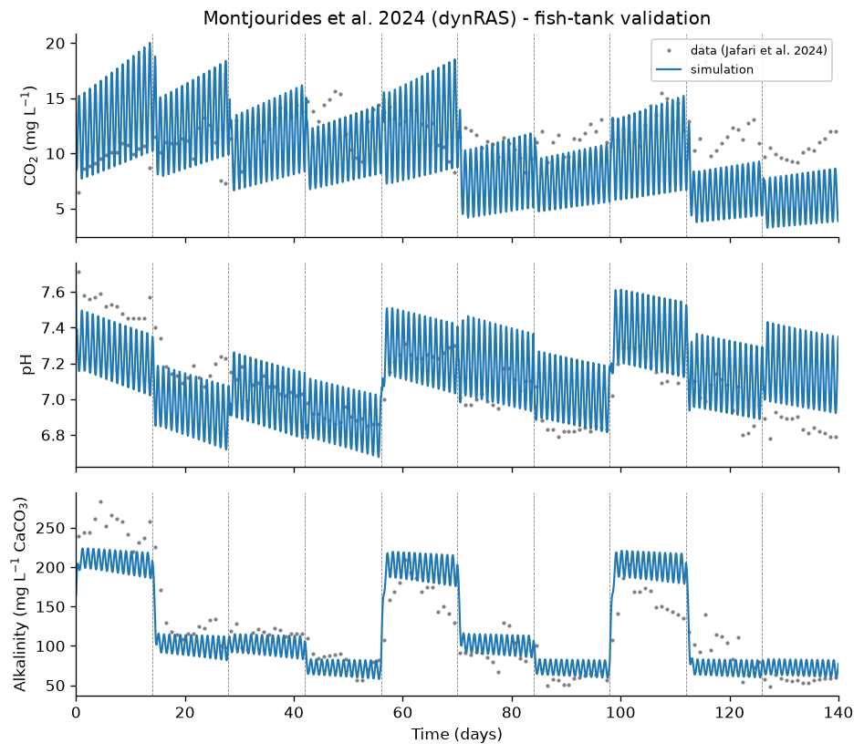
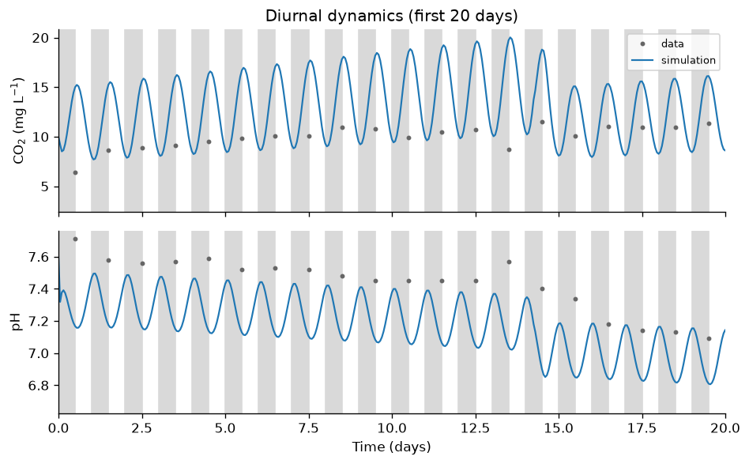
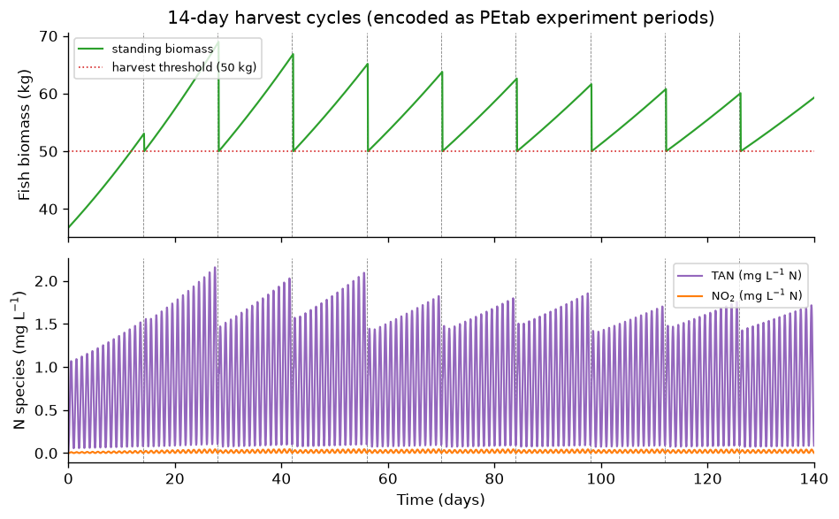

# Montjourides_bioRxiv2024

PEtab implementation of the **dynRAS** model of a recirculating aquaculture
system (RAS) with alkalinity and pH control:

> M. Montjourides et al.
> *dynRAS: a dynamic model of recirculating aquaculture systems with a focus on
> alkalinity and pH control.*
> bioRxiv, 2024. doi:[10.1101/2024.06.28.600787](https://doi.org/10.1101/2024.06.28.600787)

Original model, data and Python code: https://github.com/Marizauto/dynRAS
(license CC-BY-NC-ND 4.0). The model builds on Pedersen (2018) and Wik (2008)
and adds an explicit carbonate system. It is parameterised and validated
against the pilot-scale RAS trial of Jafari et al. (2024).

This is a **PEtab v2** problem (`format_version: 2.0.0`). The repeated 14-day
fish-harvest resets are encoded in the PEtab experiment/condition tables rather
than in the SBML model (see below), using the same mechanism as
`Cook_AIChE2022`.

## Model

A three-compartment ODE model of a RAS loop — **fish tank** (`_FT`, 1000 L),
**biofilter** (`_B1`, 800 L) and **degasser** (`_DGS`, 700 L) — connected in a
recirculation loop (fish tank → biofilter → degasser → fish tank) at a flow
rate `F = 1 L s⁻¹`. The degasser additionally exchanges 25 % of the total
system volume per day with a fixed-composition make-up sump and strips CO₂ at a
first-order rate `r_deg`.

The 28 states (concentrations in mmol L⁻¹ unless noted) are, per compartment:

* carbonate system: `CO2aq`, `HCO3`, `CO32`, `H`, `OH`;
* nitrogen: `NH4`, `NH3`, `NO2`;
* fish tank only: fish weight `Fishweight_FT` (g) and standing biomass
  `Fish_Biomass_FT` (g);
* biofilter only: ammonia- and nitrite-oxidising bacteria `AOB_B1`, `NOB_B1`.

Fast reversible reactions interconvert the carbonate and ammonia species in
every compartment. Fish in the tank respire CO₂ and excrete total ammonia
nitrogen (TAN), both modulated over the day (see *Diurnal drivers* below). In
the biofilter, AOB oxidise ammonia to nitrite and NOB oxidise nitrite,
consuming alkalinity; both populations grow logistically toward a carrying
capacity. Fish grow according to a thermal-growth-coefficient law. Alkalinity
is controlled in the biofilter by dosing NaHCO₃ or NaOH, with the dosing target
switching between ~200, ~100 and ~70 mg L⁻¹ CaCO₃ over eleven 14-day windows
that reproduce the Jafari et al. (2024) experimental protocol.

### Diurnal drivers

The reference code drives the diurnal CO₂ respiration and TAN excretion from a
`floor`-based time-of-day. AMICI supports neither `floor` nor a periodic timer
reset without a per-day event, and 140 daily event reinitialisations make the
very stiff carbonate system numerically intractable at the tolerances used by
the collection's simulator. These two drivers are therefore replaced by smooth
continuous raised-cosine surrogates of the day phase `ph = 2π·t/86400`:

* `co2_diurnal = 1 + 0.274·(1 − cos ph)` — matches the reference tent's
  midnight value (1) and noon peak (`1.037¹² = 1.548`);
* `mod_prop = 1 − 0.9·cos ph` — matches the reference beta(3,3) driver's daily
  mean (1), midnight floor (0.1) and noon peak.

At the daily measurement resolution used here the surrogate reproduces the
reference dynRAS simulation almost exactly (see *Differences* below).

## Data

The pilot-trial time series from Jafari et al. (2024), provided in the dynRAS
repository (`Code_figure/Experimental_data`), sampled at high frequency in the
fish tank over ~142 days. Three quantities are used:

| observable              | quantity (fish tank)          | source file            |
|-------------------------|-------------------------------|------------------------|
| `observable_CO2`        | dissolved CO₂ [mg L⁻¹]        | `co2_alkalinity.csv`   |
| `observable_pH`         | pH                            | `ph_data.csv`          |
| `observable_alkalinity` | alkalinity [mg L⁻¹ CaCO₃]     | `co2_alkalinity.csv`   |

For the benchmark the raw high-frequency records are **subsampled to one point
per day at midday** (day 0.5, 1.5, …, 139.5), giving 140 points per observable
(420 measurements). Midday sampling keeps the measurement times clear of the
14-day harvest boundaries.

## PEtab problem

PEtab v2 (`format_version: 2.0.0`). The files are:

* **Model** (`model_Montjourides_bioRxiv2024.xml`): the 28-state ODE system as
  SBML rate rules (built by `create_model.py`). Time is in seconds. There are
  **no SBML events**.
* **Observables** (`observables_Montjourides_bioRxiv2024.tsv`): the three
  fish-tank quantities above, computed from the states exactly as in the
  reference validation figure
  (`CO2aq_FT·44`; `−log₁₀(H_FT·10⁻³)`; `(OH_FT + HCO3_FT + 2·CO32_FT − H_FT)·50.04`).
  Gaussian noise with one estimated standard deviation per observable.
* **Conditions** (`conditions_Montjourides_bioRxiv2024.tsv`): `init` (initial
  period) and `harvest` (the 14-day biomass reset, below).
* **Experiments** (`experiments_Montjourides_bioRxiv2024.tsv`): one 140-day
  timecourse (`Montjourides_bioRxiv2024`) that starts with `init` and applies
  `harvest` at each ~14-day boundary.
* **Estimated parameters** (`parameters`): six parameters that shape the
  observables — the fish CO₂ respiration coefficient `co2_resp`, the degasser
  CO₂ stripping rate `r_deg`, the AOB maximum specific growth rate `muAOB`, and
  the three measurement standard deviations `sigma_CO2`, `sigma_pH`,
  `sigma_alkalinity`. (PEtab v2 has no `parameterScale` column; bounds are on
  linear scale.)

### 14-day harvest resets as PEtab experiments

Every 14 days the reference code harvests fish so that the standing biomass
does not exceed the maximum of 50 kg (`fish_max = 50000 g`). This is expressed
as the PEtab `harvest` **condition**

```
harvest  Fish_Biomass_FT  piecewise(fish_max, Fish_Biomass_FT > fish_max, Fish_Biomass_FT)
```

applied by the experiment at `t = 14.25, 28.25, …, 126.25 d`. Because the
biomass ODE is written as `dB/dt = (B/w)·dw/dt` (with `w` the fish weight),
capping `B` also reduces the implied fish number, so subsequent CO₂ and TAN
production scale correctly. The SBML model contains no events; the experiment
periods define the harvest boundaries, leaving the model itself a plain,
reusable ODE system.

The harvests are placed 0.25 d **after** the 14-day boundaries so that a reset
never coincides with the dosing-regime discontinuity at the exact boundary
(simultaneous reinitialisations otherwise crash the solver); since the biomass
is capped regardless, the 6 h offset is inconsequential.

### Simulation

The problem imports and simulates with AMICI (`src/python/simulate.py`); AMICI
encodes the experiment periods as events internally. As for `Cook_AIChE2022`
the AMICI **absolute tolerance is loosened from its default to `1e-12`**
(`rtol = 1e-10`). The `simulatedData` table was generated at those tolerances
(total log-likelihood ≈ **−1211.85** at the nominal parameters).

## Nominal parameters

The estimated parameters take their reference (paper / Pedersen 2018) values:

| parameter          | nominal              | note                                        |
|--------------------|---------------------:|---------------------------------------------|
| `co2_resp`         | 62.5                 | fish CO₂ respiration coefficient            |
| `r_deg`            | 0.0015               | degasser first-order CO₂ stripping rate     |
| `muAOB`            | 6.076e-6 s⁻¹         | AOB max specific growth rate (Pedersen 2018)|
| `sigma_CO2`        | 2.0                  | CO₂ measurement sd [mg L⁻¹]                 |
| `sigma_pH`         | 0.2                  | pH measurement sd                           |
| `sigma_alkalinity` | 50.0                 | alkalinity measurement sd [mg L⁻¹ CaCO₃]    |

All other kinetic and biological constants are fixed at their reference values
(see `create_model.py`). At the nominal parameters the model tracks the pilot
data with RMSEs of ≈4 mg L⁻¹ (CO₂), ≈0.22 (pH) and ≈31 mg L⁻¹ CaCO₃
(alkalinity): a mechanistic prediction rather than an exact fit, which leaves
room for parameter estimation.

## Differences from the original publication

* **Smooth diurnal drivers** (see above) replace the `floor`-based
  time-of-day drivers. At the daily-midday measurement resolution the
  difference from the reference dynRAS simulation is negligible: mean absolute
  deviation ≈0.02 (pH), ≈0.45 mg L⁻¹ (CO₂) and ≈0.8 mg L⁻¹ CaCO₃ (alkalinity)
  over the 140-day trajectory.
* **Harvest as PEtab experiment periods** (see above), applied 0.25 d after
  each boundary, with the standing biomass capped exactly at 50 kg (the
  reference rounds to an integer number of fish, giving ≈50.04 kg).
* **Default (Jafari et al. 2024) scenario only.** The reference code also
  offers HCO₃-only, NaOH-only, combined-CO₂-based and pH-control dosing
  scenarios (by editing `ChemODE_BIO.py`); only the default validation scenario
  is implemented here.
* **Estimated-parameter subset.** Of the reference's many fixed constants, only
  the six parameters that measurably influence the CO₂/pH/alkalinity
  observables are marked for estimation; the rest are fixed.

## Reproducing the figures

`make_figures.py` simulates the PEtab problem itself with **AMICI** (via
`src/python/simulate.py`), using dense output so AMICI applies the `harvest`
condition at every ~14-day boundary. The data points are the problem's own
daily measurements.

```bash
python make_figures.py   # requires petab (v2), amici, matplotlib, numpy
```

### Figure 1 — fish-tank validation
Simulated CO₂, pH and alkalinity (blue) against the Jafari et al. (2024) daily
data (grey). Vertical dashed lines mark the 14-day harvest / dosing-regime
boundaries; the alkalinity panel shows the dosing target stepping between ~200,
~100 and ~70 mg L⁻¹ CaCO₃.



### Figure 2 — diurnal dynamics (first 20 days)
CO₂ and pH over the first 20 days, showing the diurnal oscillation of the
raised-cosine drivers (shaded bands mark the daily feeding periods).



### Figure 3 — harvest cycles and the nitrogen cascade
Standing fish biomass (the 14-day harvest sawtooth, encoded as PEtab experiment
periods) and the fish-tank TAN and nitrite concentrations produced by
excretion and biofilter nitrification.


